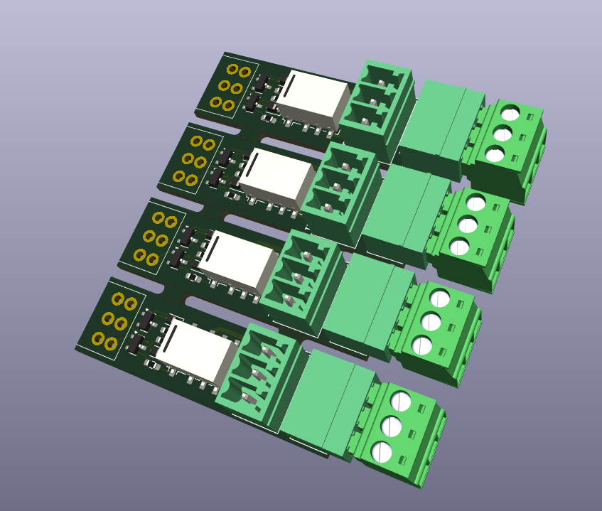

# OS-unifrog-latching-relay

Standalone dual coil latching relay module designed for frog polarity switching on unifrog turnouts.  
This board can be triggered by any solenoid decoder with classic twin-coil outputs.

---

## 📷 Hardware Overview

---

## 📘 Documentation

This relay module is intended as an add-on for the [OS-Solenoid-Decoder](https://github.com/Open-Source-Model-Railway-Electronics/OS-Solenoid-Decoder).

🧾 For detailed wiring and usage instructions, refer to the manual of the OS-Solenoid-Decoder:

📄 [OS-Solenoid-Decoder Manual (PDF)](https://github.com/Open-Source-Model-Railway-Electronics/OS-Solenoid-Decoder/blob/main/docs/Manual.pdf)

---

## 🔌 Compatibility

- Works with:
  - OS-Solenoid-Decoder
  - Any decoder with classic dual pulse output
- Designed for:
  - PECO unifrog
  - Other turnout brands with isolated frog

---
